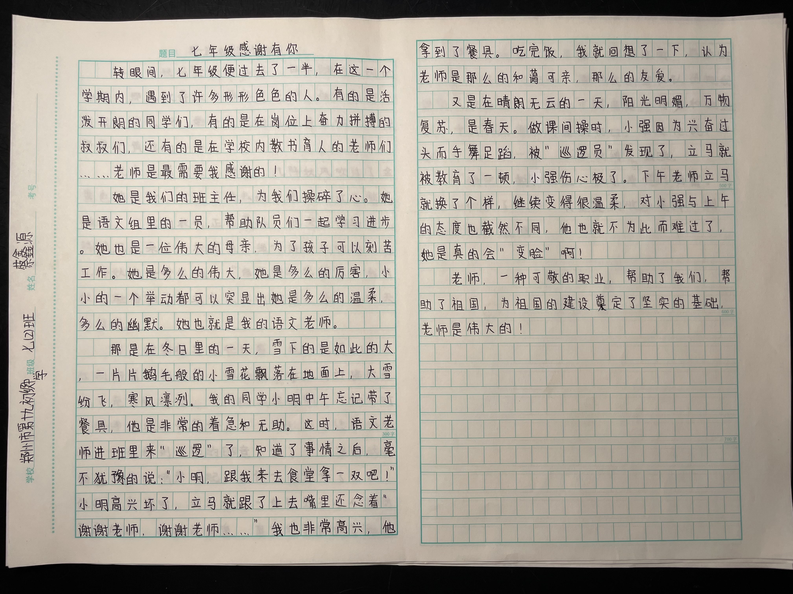
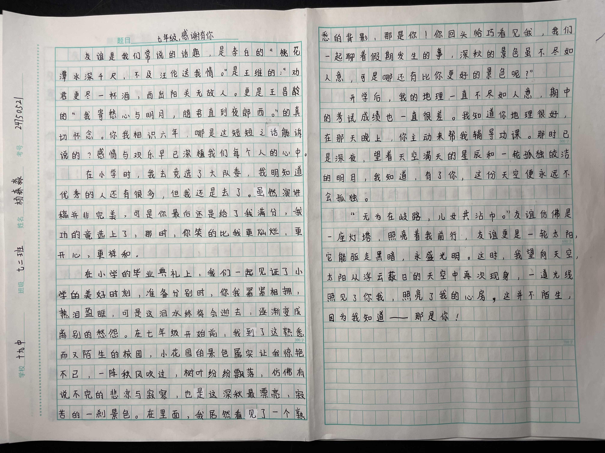
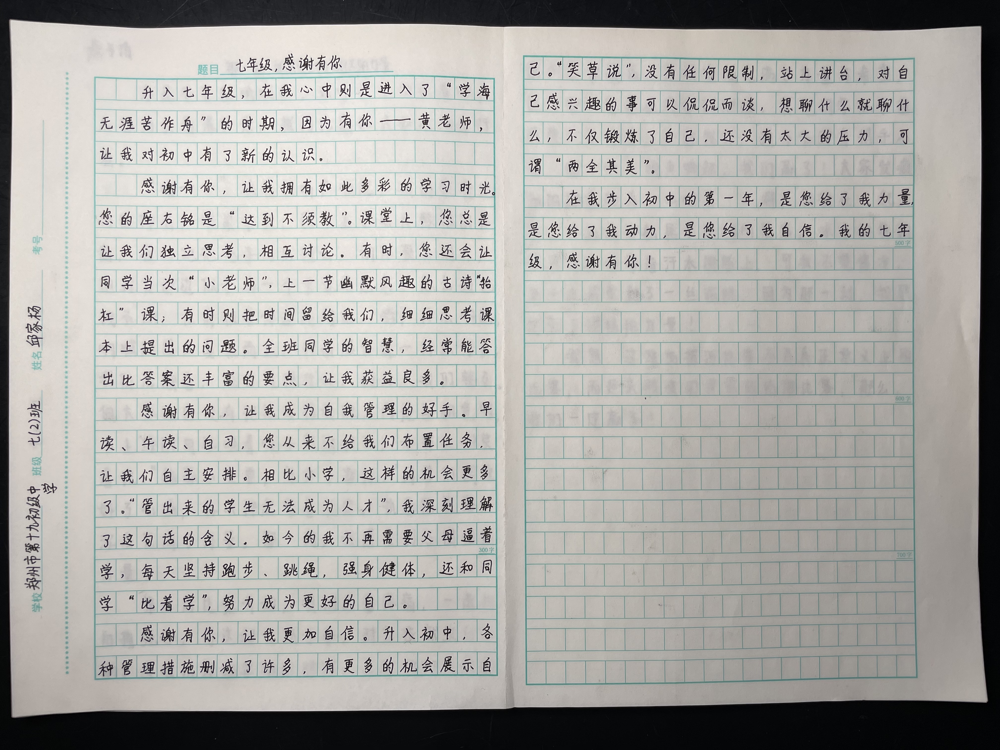
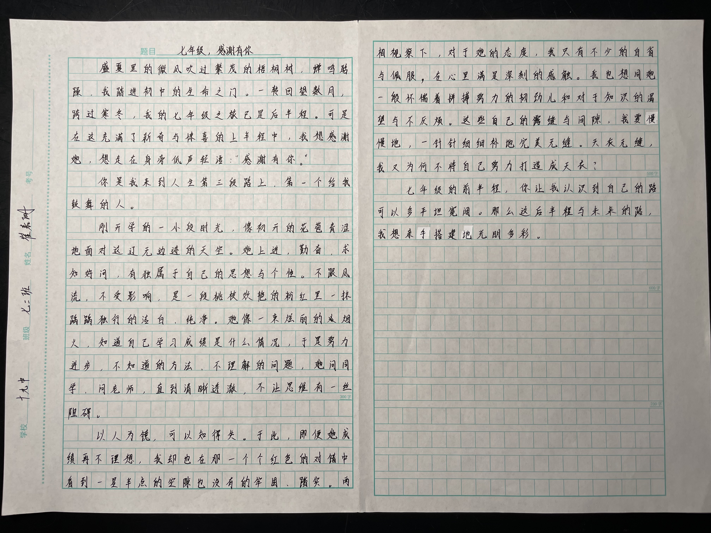
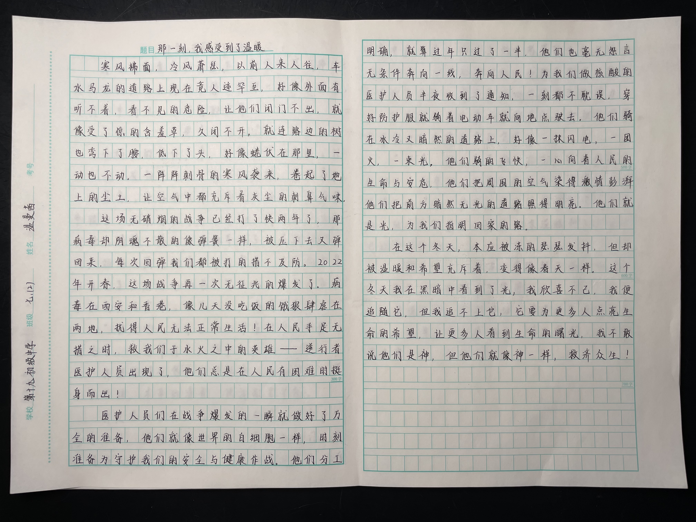
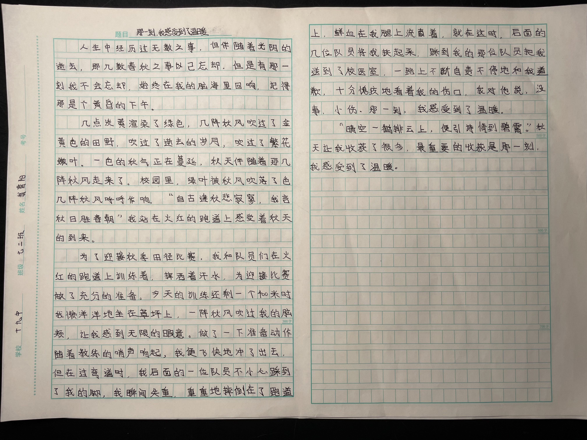
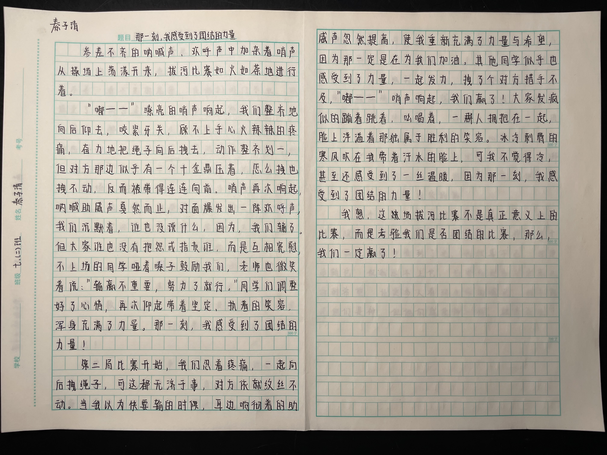
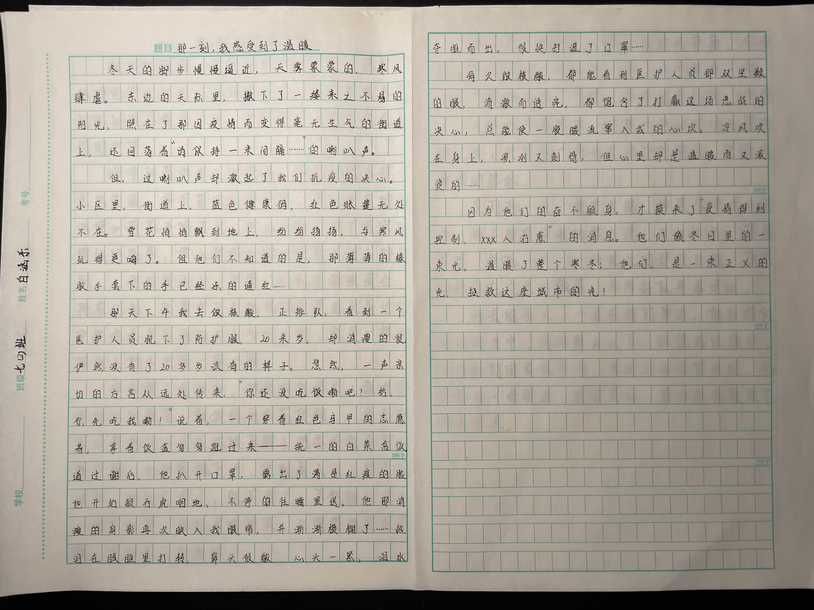
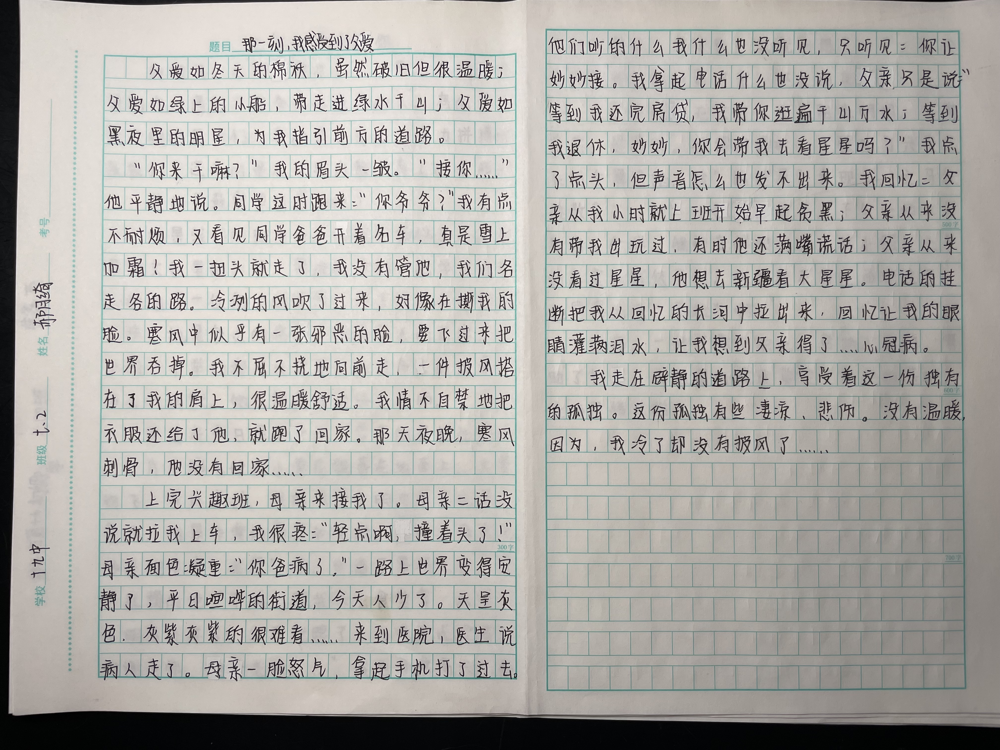
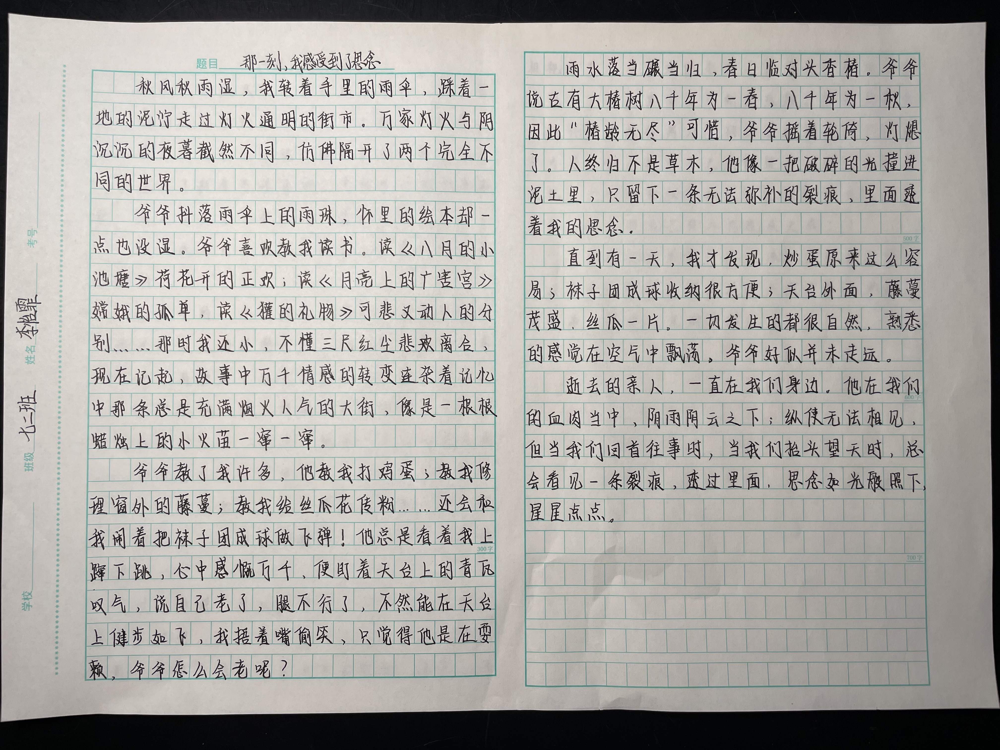

<link rel="stylesheet" type="text/css" href="style.css">

<a href="https://zz19z-2021-2.github.io/"><button class="button group-left">首页</button></a><a href="https://zz19z-2021-2.github.io/feedback.html"><button class="button group-left">反馈 / 帮助</button></a><a href="https://zz19z-2021-2.github.io/overview.html"><button class="button group-right">内容总览</button></a>

 
 

# 七上期末考试优秀作文展评

## 七年级，感谢有你

### 蔡鑫源《七年级，感谢有你》

转眼间，七年级便过去了一半，在这一个学期内，遇到了许多形形色色的人。有的是活泼开朗的同学们，有的是在岗位上奋力拼搏的叔叔们，还有的是在学校内教书育人的老师们……老师是最需要我感谢的！

她是我们的班主任，为我们操碎了心。她是语文组里的一员，帮助队员们一起学习进步。她也是一位伟大的母亲，为了孩子可以刻苦工作。她是多么的伟大，她是多么的厉害，小小的一个举动都可以突显出她是多么的温柔，多么的幽默。她也就是我的语文老师。

那是在冬日里的一天，雪下的是如此的大，一片片鹅毛般的小雪花飘落在地面上，大雪纷飞，寒风凛冽。我的同学小明中午忘记带了餐具，他是非常的着急和无助。这时语文老师进班里来“巡罗”了，知道了事情之后，毫不犹豫的说：“小明，跟我来去食堂拿一双吧！”小明高兴环了，立马就跟了上去嘴里还念着“谢谢老师，谢谢老师……”我也非常高兴，他拿到了餐具。吃完饭，我就回想了一下，认为老师是那么的和蔼可亲，那么的友爱。

又是在晴朗无云的一天，阳光明媚，万物复苏，是春天。做课间操时，小强因为兴奋过头而手舞足蹈，被“巡遇员”发现了，立马就被教育了一顿，小强伤心极了。下午老师立马就换了个样，继续变得很温柔，对小强与上午的态度也截然不同，他也就不为此而难过了，她是真的会“变脸”啊！

老师，一种可敬的职业，帮助了我们，帮助了祖国，为祖国的建设奠定了坚实的基础，老师是伟大的！

> 共559字

### 杨森淼《七年级，感谢有你》

友谊是我们常说的话题，是李白的“桃花潭水深千尺，不及汪伦送我情~~。”~~是王维的~~：~~“劝君更尽一杯酒，西出阳光无故人。更是王昌龄的“我寄愁心与明月，随君直到夜郎西~~。”~~的真切怀念。你我相识六年，哪是这短短之话能诉说的？感情与双乐早已深植我们每个人的心中。

在小学时，我去竞选了大队委，我明知道优秀的人还有很多，但我还是去了。虽然演讲稿并非完美，可是你最后还是给了我满分，我~~功的~~竟选上了，那时，你笑的比我更灿烂，更开心，更祥和。

在小学的毕业典礼上，我们一起见证了小学的美好时刻，准备分别时，你我紧紧相拥，热泪盈眶，可是这泪水终将会逝去。逐渐变成离别的愁怨。在七年级开始前，我到了这熟悉而又陌生的校园，小花园的景色属实让我惊艳不已，一阵秋风欢过，树对纷纷飘落，仿佛有说不完的悲凉与寂寥，也是这深秋最漂亮，寂苦的一刹景色。在里面，我居然看见了一个熟悉的背影，那是你！你回头恰巧看见我，我们一起聊着假期发生的事，深秋的景色虽不尽如人意，可是哪还有比你更好的景色呢？”

开学后，我的地理一直不尽如人意，期中的考试成绩也一直很差。我知道你地理很好，在那天晚上，你主动来帮我辅导功课。那时已是深夜，望着天空满天的星辰和一轮孤独皎洁的明月，我如道，有了你，这份天空便永远不会孤独。

“无为在~~岐~~路，儿女共沾巾。”友谊仿佛是一座灯塔，照亮着我前行，友谊更是一轮太阳，它能驱走黑暗，永盛光明。这时，我望向天空，太阳从浮云蔽日的天空中再次现身，一道光线照见了你我，照亮了我的心房，这并不陌生，因为我知道——那是你！

> 共620字
>
> [注1]

### 邱家杨《七年级，感谢有你》

升入七年级，在我心中则是进入了“学海无涯苦作舟”的时期，因为有你——黄老师让我对初中有了新的认识。

感谢有你，让我拥有如此多彩的学习时光。您的座右铭是“达到不须教”。课堂上，您总是让我们独立思考，相互讨论。有时。您还会让同学当次“小老师”，上一节幽默风趣的古诗“抬杠课”；有时则把时间留给我们，细细思考课本上提出的问题。全班同学的智慧，经常能答出比答案还丰富的要点，让我获益良多。

感谢有你，让我成为自我管理的好手。早读、午读、自习，您从来不给我们布置任务，让我们自主安排。相此小学，这样的机会更多了。“管出来的学生无法成为人才”，我深刻理解了这句话的含义。如今的我不再需要父母逼着，每天坚持跑步、跳绳，强身健体，还和同学“比着学”，努力成为更好的自己。

感谢有你，让我更加自信。升入初中，各种管理措施删减了许多，有更多的机会展示自己。“笑草说”，没有任何限制，站上讲台，对自己感兴趣的事可以侃侃而谈，想聊什么就聊什么，不仅锻炼了自己，还没有太大的压力，可谓“两全其美”。

在我步入初中的第一年，是您给了我力量，是您给了我动力，是您给了我自信。我的七年级，感谢有你！

> 共454字

### 崔嘉珊《七年级，感谢有你》

盛夏里的微风吹过繁茂的梧桐树，蝉鸣聒躁，我踏进初中的生命之门。一转回望数月，跨过寒冬，我的七年级之旅已是后半程。可是在这充满了新奇与惊喜的上半程中，我想感谢她，想走在身旁低声轻语：“感谢有你。”

你是我来到人生第三段路上，第一个给我鼓舞的人。

刚开学的一小段时光，像初开的花苞青涩的面对这辽无边际的天空。她上进、勤奋、求知好问，有独属于自己的思想与个性。 不跟风流，不受影响，是一段桃枝妖艳的粉红里一抹踽踽独行的洁白、纯净。 她像一束绚丽的烟火， 知道自己学习成绩是什么情况，于是努力进步，不知道的方法、不理解的问题，她问同学，问老师，直到清晰透~~澈~~，不让思维有一丝阻碍。

以人为镜，可以知得失。于此，即便她成绩再不理想，我却也在那一个个红色的对错中看到一星半点的空隙也没有的牢固、踏实。 两相视察下，对他的态度，我只有不少的自省与佩服，在心里满是深刻的感触。 我也想同她一般怀揣着拼搏努力的韧劲儿和对知识的渴望与不厌烦。这些自己的露缝和间隙，我要慢慢地，一针针细细补~~地~~完美无缝。天衣无缝，我又为何不将自己努力打造成天衣？

七年级的前半场，你让我认识到自己的路可以多平坦宽阔。那么这后半程与未来的路，我想亲手搭建~~地~~光明多彩。

> 共481字
>
> [注1]

## 那一刻，我感受到了\_\_\_\_\_\_\_\_

### 赵妙格《那一刻，我感受到了温暖》

我站在瓷青色的天空下，刺骨的寒风拂过我的脸肤，直击我的心肺。但那一股股的暖意，从我心中淌过,流遍我的全身。

“快点，上学要来不及了！”

在妈妈的催促声中，我慌忙穿好衣服。过了一夜，衣物早已没了昨日的温暖，反而多了一份寒意。身体吸收掉了前夜晚饭，只觉得腹中很空，如果我能早起一会儿，或许就可以吃上热气腾腾、香气四溢的早饭了。在我恍惚之时，妈妈从厨房跑来，手里拿着一个用纸包着的肉包子，妈妈包的包子很好吃，是鲜肉和蔬菜的完美结合体，咬下一口，满嘴留香。

“快走吧！去车上吃，节省时间！”妈妈一边说着，一边帮我系上围巾。

我还沉浸在包子的美味中，肉的鲜美，萝卜的甘甜，木耳的清香，使我欲罢不能。

我走在小区里，到了小区大门，因为手里拿着包子，很难推开着“千斤重”的铁门。我急得满头是汗。这时候，小区的保安爷爷从保安室中走出来，布满了陈年老茧的大手出现在我的面前，与我的手相比，他的手黝黑、粗糙，还有很多伤口，然而，这双大手结实而有力，一下子就推开了这扇“拦路虎”，我扭头道谢，爷爷露出来朴实无华的笑容。

“没事，助人为乐嘛，你怎么只吃包子？我那里有瓶牛奶，刚刚放在热水里温了温，给你喝了吧！”他一边说，一边从保安室拿了盒牛奶，放在我的手里。牛奶的余温暖热的我的手，更暖热了我的心。

“快走吧，一会子上学迟到了嘞！”他讲着一口方言，再次露出了笑容。

我道了谢，走到车站，看着手里的牛奶和包子，暖意从我心中淌过。有了您们，三冬暖，春不寒……

> 共583字

### 温曼茜《那一刻，我感受到了温暖》

寒风拂面，冷风萧瑟，以前人来人往~~，~~车水马龙的道路上现在竟人迹罕至，好像外面有听不着，看不见的危险，让他们闭门不出，就像受了惊的含羞草，久闭不开，就连路边的树也弯下了腰，低下了头，好像蜷伏在那里，一动也不动。一阵阵刺骨的寒风袭来，卷起了地上的尘土，让空气中都充斥着灰尘的刺鼻气味。

这场无硝烟的战争已经打了快两年了，那病毒却阴魂不散的像弹簧一样。被压下去又弹回来，每次回弹我们都被打的~~措~~不及防。2022年开春，这场战争再一次无征兆~~的~~爆发了。病毒在西安和香港，像几天没吃饭的饿狼肆虐在两地，扰得人民无法正常生活！在人民手足无措之时，救我们于水火之中的来雄——逆行者医护人员出现了，他们总是在人民有困难时挺身而出！

医护人员们在战争爆发的一瞬就做好了万全的难备，他们就像世界的白细胞一样，时刻准备为守护我们的安全与健康作战。他们分工明确，就算过年只过了一半，他们也毫无怨言无条件奔向一线，奔向人民！为我们做核酸的医护人员半夜收到了通知，一刻都不耽误穿好防护服就骑着电动车~~就~~向地点驶去。他们骑在冰冷又暗然的道路上，好像一抹闪电，一团火，一束光，他们骑~~的~~飞快，一心向着人民的生命与安危，他们把周围的空气染得激情彭湃他们把前方暗然无光的道路照得明亮。他们就是光，为我们指明回家的路。

在这个冬天，本应被冻~~的~~瑟瑟发抖，但却被温暖和希望充斥着，变得像春天一样。这个冬天我在黑暗中看到了光，我欣喜不已，我便追随它，但我追不上它，它要为更多人点亮生命的希望，让更多人看到生命的曙光，我不敢说他们是神，但他们就像神一样，救济众生！

> 共637字
>
> [注1]

### 翁睿阳《那一刻，我感受到了温暖》

人生中经历过无数之事，但件随着光阴的逝去，那九数春秋之事已忘却，但是有那一刻我不会忘却，始终在我的脑海里回响，记得那是个黄昏的下午。

几点淡黄渲染了绿色，几阵秋风吹过了金黄色的田野，吹过了逝去的岁月，吹过了繁花嫩叶。一色的秋气正在蔓廷，秋天伴随着那几阵秋风走来了。校园里，绿叶被秋风吹落了色几阵秋风呼呼作响。“自古逢秋悲寂寥，我言秋日胜春朝”我站在火红的跑道上感受着秋天的到来。

为了迎接秋季田径比赛，我和队员们在火红的跑道上训东着，挥洒着汗水，为迎接比赛做了充分的准备。今天的认练还剩一个400米时我懒洋洋地坐在草坪上，一阵秋风吹过我的~~脑~~颊，让我感到无限的暇意。做了一下准备动作随着教练的哨声响起，我便飞快地冲了出去，但在过弯道时，我后面的一位队员不小心踩到了我的脚，我瞬间失重，重重地摔倒在了跑道上，鲜血在我腿上流着，就在这时，后面的几位队员将我扶起来，踩到我的那位队员把我送到了校医室，一路上不断自责不停地和我道歉，十分愧疚地看着我的伤口，我对他说，没事，小伤。那一刻，我感受到了温暖。

“晴空一鹤排云上，便引诗情到碧霄。”秋天让我收获了很多，最重要的收获是那一刻，我感受到了温暖。

> 共478字
>
> [注1]

### 秦子清《那一刻，我感受到了团结的力量》

参差不齐的呐喊声~~，~~欢呼声中~~加~~杂着哨声从操场上荡漾开来，拔河比赛如火如荼地进行着。

“嘟——”嘹亮的哨声响起，我们整齐地向后仰去，咬紧牙关，顾不上手心火辣辣的疼痛，奋力地把绳子向后拽去，动作整齐划一，但对方那边似乎有一个千~~金~~鼎压着，怎么拽也拽不动，反而被带得连连向前。哨声再次响起，呐喊助威声戛然而止，对面爆发出一阵欢呼声，我们沉默着，谁也没说什么，因为，我们输了。但大家谁也没有抱怨或指责谁，而是互相宽慰，不上场的同学哑着嗓子鼓励我们，老师也微笑着说：“输赢不重要，努力了就行。”同学们调整好了心情，再次仰起着坚定、执着的笑容，浑身充满了力量。那一刻，我感受到了团结的力量！

第二局比赛开始，我们忍着疼痛，一起向后拽绳子，可是这都无济于事，对方依~~就~~纹丝不动。当我以为快要输的时候，耳边响彻着的助威声忽然提高，使我重新充满了力量与希望，因为那一定是在为我们加油。其他同学似乎也感受到了力量，一起发力，拽了个对方措手不及，“嘟——”哨声响起，我们赢了！大家发疯似的蹦着跳着，吆喝着，一群人拥抱在一起，脸上洋溢着那独属于胜利的笑容。冰冷刺骨的寒风吹在我带着汗水的脸上，可我不觉得冷，甚至还感受到了一丝温暖，因为那一刻，我感受到了团结的力量！

我想，这场拔河比赛不是真正意义上的比赛，而是考验我们是否团结的比赛，那么，我们一定赢了！

> 共544字
>
> [注1]

### 白涵乐《那一刻，我感受到了温暖》

冬天的脚步慢慢逼近，天雾蒙蒙的，寒风肆虐。东边的天际里，撒下了一缕来之不易的阳光。照在了那因疫情而变得毫无生气的街道上，还回荡着“请保持一米间隔……”的喇叭声。

但，这喇叭声缺激起了我们抗疫的决心。小区里，街道上，蓝色健康吗，红色帐篷无处不在。雪花悄悄飘到地上，纷纷扬扬，与寒风玩得更嗨了。但~~他~~们不知道的是，那薄薄的橡胶手套下的手已经冻~~的~~通红……

那天下午我去做核酸，正排队，看到一个医护人员脱下了防护服，20来岁，却消瘦~~的很~~俨然没有了20多岁该有的样子。忽然，一声亲切的方言从远处传来，“你还没吃饭嘞吧？给，你先吃我嘞！”说着，一个穿着红色马甲的志愿者，拿着饭盒匆匆跑过来——统一的白菜盒饭。道过谢后，他扒开口罩，露出了满是红痕的脸，他开始狼吞虎咽地、不停~~的~~往嘴里送，他那消瘦的身影再次映入我眼帘，并渐渐模糊了……热泪在眼眶里打转，鼻头很酸，心头一紧，泪水夺眶而出，很快打湿了口罩……

每次做核酸，都能看到医护人员那双坚毅的眼，清澈而透亮，都饱含了打赢这场恶战的决心，总能使一股暖流窜入我的心坎。冷风吹在身上，凛冽又刺骨，但心里却是温暖而滚烫的……

因为他们的奋不顾身，才换来了“疫情得到控制、XXX人治愈“的消息。他们像冬日里的一束光，温暖了整个寒冬；他们，是一束正义的光，拯救这座城市的光！

> 共518字
>
> [注1]

### 郝月绮《那一刻，我感受到了父爱》

父爱如冬天的棉袄，虽然破旧但很温暖；父爱如绿上的小船，带走进绿水青山；父爱如黑夜里的明星，为我指引前方的道路。

“你来干嘛？” 我的眉头一皱。“接你……”他平静地说。同学这是跑来：“你爷爷？” 我有点不耐烦，又看见同学爸爸开着名车，真是雪上加霜！我一扭头就走了，我没有管它，我们各走各的路。冷冽的风吹了过来，好像在撕我的脸。寒风中似乎有一张邪恶的脸，要飞过来把世界吞掉。我不屈不挠地向前走，一件披风搭在了我的肩上，很温暖舒适。我情不自禁地把衣服还给了他，就跑了回家。那天夜晚，寒风刺骨，他没有回家……

上完兴趣班，母亲来接我了。母亲二话没说就拉我上车，我很疼：“轻点啊，撞着头了！ ” 母亲面色凝重： “你爸病了。”一路上世界变得安静了，平日喧哗的街道，今天人少了。天呈灰色，灰紫灰紫的很难看……来到医院，医生说病人走了。母亲一脸怒气，拿起手机打了过去。 他们炒的什么我什么也没听见，只听见：你让妙妙接。我拿起电话什么也没说，父亲只是说： “等到我还完房贷，我带你逛遍千山万水；等到我退休，妙妙，你会带我去看星星吗？” 我点了点头，但声音怎么也发不出来。我回忆：父亲从小时就上班开始起早贪黑； 父亲从来没有带我出玩过，有时他还满嘴谎话；父亲从来没看过星星， 他想去新疆看大星星。 电话的挂断把我从回忆的长河中拉出来，回忆让我的眼睛挂满泪水，让我想到了父亲得了……心冠病。

我走在~~辟~~静的道路上，享受着这一份独有的孤独。这份孤独有些凄凉、悲伤。没有温暖，因为，我冷了却没有披风了……

> 共594字
>
> [注1]

### 李怡霏《那一刻，我感受到了思念》

秋风秋雨湿，我转着手里的雨伞，踩着一地的泥泞走回灯火通明的街市。万家灯火与阴沉沉的夜~~暮~~截然不同，仿佛隔开了两个完全不同的世界。

爷爷抖落雨伞上的雨珠，怀里的绘本却一点也没湿。你也喜欢叫我读书。读《八月的小池塘》荷花开得正欢；真读《月亮上的广寒宫》嫦娥的孤单，读《獾的礼物》 可悲又动人的分别……那时我还小，不懂三尺红尘悲欢离合，现在记起，故事中万千情感的转变连杂着记忆中那条总是充满烟火人气的大街，像是一根根蜡烛上的小火苗一窜一窜。

爷爷教了我许多，他叫我打鸡蛋；教我修理窗外的藤蔓；教我给丝瓜花传粉……还会和我闹着把袜子团成球做飞弹！他总是看着我上蹿下跳，心中感慨万千，便盯着天台上的青瓦叹气，说自己老了，腿不行了，不然能在天台上健步如飞，我捂着嘴偷笑，只觉得他是在耍赖，爷爷怎么会老呢？

雨水落当碾当归，春日临对头香椿。爷爷说古有大椿树八千年为一春，八千年为一秋，因此“椿龄无尽”可惜，爷爷摇着轮椅，灯熄了。人终归不是草木，他像一把破碎的光撞进泥土里，只留下一条无法弥补的裂痕，里面透着我的思念。

直到有一天，我才发现，炒蛋原来这么容易；袜子团成球收纳很方便；天台外面，藤蔓茂盛，丝瓜一片。一切发生的都很自然，熟悉的感觉在空气中飘荡。爷爷好似并未走远。

逝去的亲人，一直在我们身边。他在我们的血肉当中，阴雨阴云之下；纵使无法相见，但当我们回首往事时，当我们抬头望天时，总会看见一条裂痕，透过里面，思念如光般照下，星星点点。

>共586字
>
>[注1]

---

[注1] 正文中划去的字（像~~这样~~）为编者认为需要修改或删去的内容。为对原文作任何改动。
